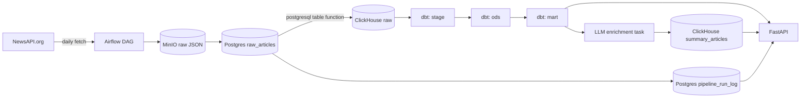

# Architecture

This file is kept short deliberately during initial build-out; it should be filled in with a full narrative (data flow rationale, layer responsibilities, scaling notes) once the pipeline is complete (Phase 5). See `docs/adr/` for the reasoning behind individual architectural decisions.
